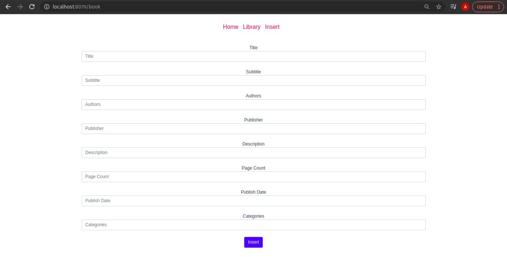
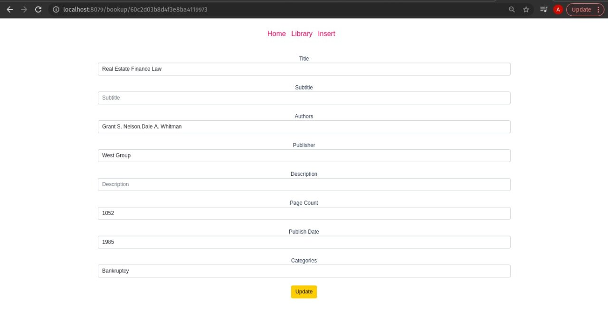

# [DAS_MICROSERVICIOS](https://github.com/alicia-granados/DAS_MICROSERVICIOS)
Repositorio para el proyecto final de la materia Diseño y Arqitectura de Software implementando  la Arquitectura de Microservicios.

## MATERIA
Diseño y Arquitectura de Software.

## Profesor
Angel Santiago Jaime Zavala.

## Equipo
- Alicia Montserrat Monjaras Granados
- Jorde de Jesús Hernández Vázquez
- Bryan Peña Balderas

## Prerequisitos
- Docker
- DockerCompose

## Diagrama de Arquitectura

## Tecnologías
Para el desarrollo principal de este proyecto utilizamos las siguientes tecnologías:
- Mongo (Database)
- MongoExpress (DBMS)
- Vue.js (Frontend)
- Flask (Backend)

Para el tema de orquestadores y contenedores utilizamos:
- Docker
- DockerCompose

### Arquitectura
La arquitectura establecida fue la de microservicios contando con un total de 6 servicios distribuidos en diferentes contenedores.
- ***Contenedor A***: Contiene una imagen funcional de **MongoDB**  
Lleva el nombre de *"mongo_db"*
- ***Contenedor B***: Contiene una imagen funcional de **MongoExpress**  
Lleva el nombre de *"dbms"*
- ***Contenedor C***: Contiene un scrapper hecho en **Python** que se encarga de traer los datos de [Vocadb](https://developers.google.com/books) e ingresarlos a la base de datos.  
Lleva el nombre de *"scraperLibros"*
- ***Contenedor D***: Contiene una imagen de **Flask**  que servirá como API para lograr la comunicación y manejo de peticiones.
Lleva el nombre de *"pyapp"*
- ***Contenedor E***: Contiene una imagen funcional de **RabbitMQ**.
Lleva el nombre de *"rabbit"*
- ***Contenedor F***: Contiene una imagen funcional de **Vue.js** que muestra la interfaz gráfica  de un sitio web, donde podrá realizar diferentes peticiones a la api
Lleva el nombre de *"vue"*

## Instrucciones para correr los contenedores
1. Clonar el repositorio.
2. Entrar a la carpeta del repositorio.
3. En caso de tener contenedores corriendo, asegurarte de que todos los contenedores están detenidos.
<code>$ sudo docker stop $(sudo docker ps -q -a)</code>
4.- Asegurarte de que todos los puertos necesarios para correr los contenedores estén disponibles.
5.- Como paso opcional puedes eliminar todas las imagenes para que no causen ningún tipo de conflicto.
<code>$ docker system prune --all</code>
6.- Corre el orquestador.
<code>$ sudo docker-compose up --build</code>
> Nota: Una vez que esté corriendo podremos ver en consola lo que esta pasando.

## Instrucciones para acceder a los servicios
1.- El servicio de MongoDB corre en el puerto *27017*.
2.- El servicio web de MongoExpress corre en http://localhost:8082.
<code>usuario: foo</code>  
<code>contraseña: bar123</code>
3.- El servicio Python (API) corre en http://localhost:5000.
3.- El servicio Flask corre en http://localhost:5001.
4.- El servicio de RabbitMQ corre en el puerto *15672* además también corre en http://localhost:15672.
5.- El servicio de Vue.js corre en http://localhost:8079

## Recorrido por Mongo Express
Este servicio permite el almacenamiento, modificación y extracción de la información en una base de datos.Primero es necesario ingresar las credenciales para tener acceso a la base de datos.

Mostrará los libros insertados desde el Contenedor C. Ahi podrás insertar , borrar, actualizar o ver la infromación  del libro mediante el dbms de Mongo.

## Recorrido por la página web de Vue.js
Este servicio se basa en consumir la API del contenedor de Flask mediante los métodos HTTP.

Al dar click en el enlace de  Library,  encontras una tabla con todos los libros que se encuentren en la base de datos.

También podrás registrar tus propios libros, por defecto el formulario ya cuenta con información
base para que la demostración sea más rápida.

Para comprobar que tu libro se ha registrado con éxito sólo debes volver a la categoría Librería y ver 
el último libro que se ha insertado.

Además contamos con las opciones de borrar, ver y actualizar.

Para borrar solo es necesario dar click en el botón delete. Después de hacer el paso anterior se mostrará la alerta con el mensaje de que se elimino el libro.

Para ver la información de solo un libro es necesario dar click en el botón de View.

Para actualizar la información de un libro es necesario dar click en Update. Después de hacer el paso anterior se mostrará un formulario con la información del libro, y si es necesario actualizar solo ingresa dicha información en el campo que le corresponda y luego dirigete a dar click en el botón de update, luego se mostrará la alerta con el mensaje de que se actualizó el libro.

## Extras
En la carpeta <code>vue</code> encontrarás otro README con detalles técnicos de Vue.js.

